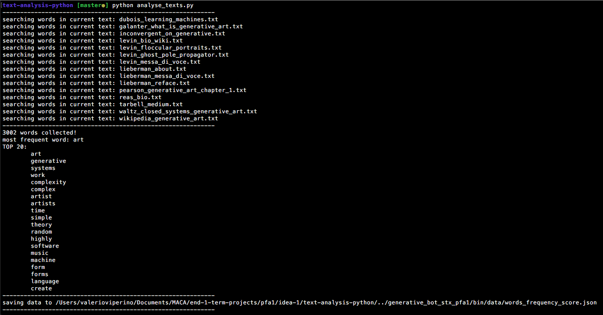
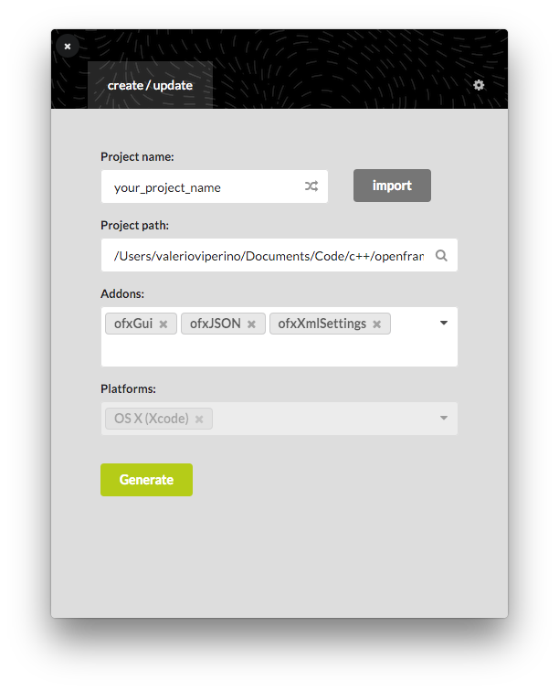
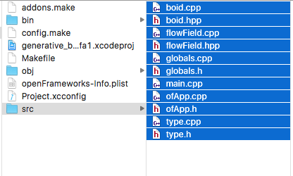
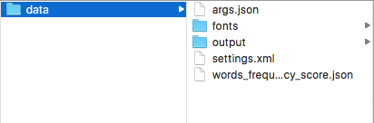

# README

This folder contains all of the necessary code for the **Programming for Artists 1** term 1 submission.

The final resulting image can be found at this path: `generative_bot_stx_pfa1/bin/data/output/the_final_one_vv.tif`

For easier browsing, an online version of this repository is available on [github](https://github.com/VVZen/MACA/tree/master/end-1-term-projects/pfa1/idea-1).

This repo contains two main folders.

1. The **text-analysis-python** directory contains the python script used to generate a list of the most recurring words used by generative artists to describe their artworks/bio.
The script loads up all the .txt files contained inside the *text-analysis-python/text-sources* directory, filters the stopwords (prepositions, conjuctions, etc..) and then saves all of the words to a sorted json array of hash tables called *words_frequency_score.json* located inside `generative_bot_stx_pfa1/bin/data/`.

	The relative data structure is like that: `[{"word" : "art", "score" : 315}, ..]`.
	
	The array is sorted by word appereances in the texts (ie: **art** is the first word and appears 315 times.).

    To run the script, simply type:
    
    ```cd text-analysis-python```

    ```python analyse_texts.py``` 

    

2. The **generative_bot_stx_pfa1** is the actual openframeworks project used to generate the final image.
 
	Why openframeworks? Because it gives me much more control. 

	The app loads up the **words_frequency_score.json** file and feeds the contained words into a boids simulation. 
Basically it just creates a B/W image (fbo) made of all the words (in white) against a (black) bg, then creates another fbo where the boids simulation happens. The boids will have **"fear"** of the black pixels in the B/W fbo, and this will lead to the boids passing much more time inside the white letters. 

	In order to run the project on your machine, you must do the openframeworks magic.. 
    1. create a new project using the of project generator
    
    2. add *ofxGUI*, *ofxJSON*, *ofxXMLSettings* as addons
    3. in the src folder of your generated project, add all the source files contained in the src folder of this repository. 
    
    	
    4. add all the files from the *bin/data* folder into your new project *bin/data* folder.
    
    5. compile!
To build the project using the **make** system, just go into the folder of your new project and type:
    ```make && make RunRelease```

## Other infos
The current project was built using **of_v0.9.8_osx_release** and **make**.

Right now the of app is set so that it will run for a random amount of time and then before exiting it will create a large 6000x3375 tif image in the *output* folder. The required time is currently set from **30 to 40 minutes**.
This amount of time is required by the boids in order to cover such a big surface.. let them paint with ease.
A 1920x1080 image will take a lot less time (5 to 10 minutes).
In order to change the resolution, edit the **globals.cpp** file.

.

Every variable in the app is tailored to the current resolution of the image, so changing the resolution will also affects aesthetics.

Also, please note that the resolution of the generated file is independent of the current size of the ofApp window, since the boids run in a separate fbo. If you don't have a 6k monitor, you'll only see a portion of the final image. My workflow was like that: first do some tests at 2k resolution. Then when testing the 300dpi version, let the app run for a while, save some screenshots and then see which edits are required.
To create a screenshot of the image while the app is still running, press 'w'. 

The app also parses a *args.json* file (inside *bin/data*), which contains a list of parameters used to edit the behaviour of the boids simulation. Editing those numbers will result in many different visual outcomes!

You can also press 'i' to show the gui, which will expose the same parameters.