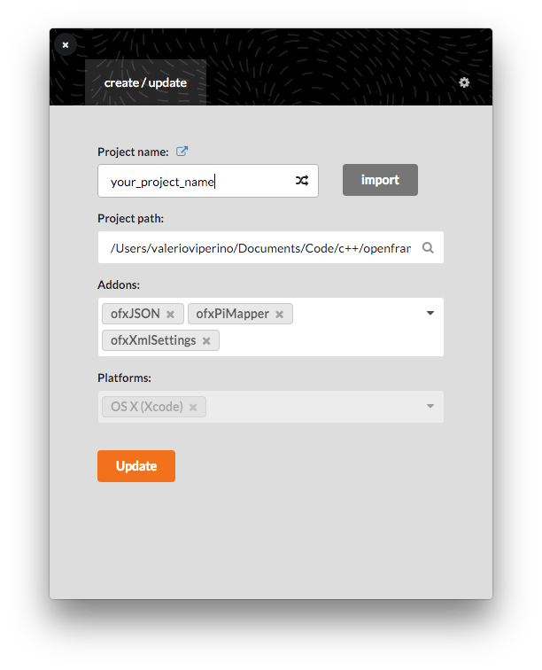
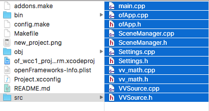
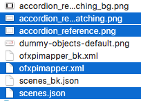

# README

An online version of this repo can be viewed on [github](https://github.com/VVZen/MACA/tree/master/end-1-term-projects/wcc/of_wcc1_project_term).

Structure
---------
Every generative animation is contained inside one of the 4 main functions who are called by `draw()`. Each of the functions represents a different **scene**.

 This allowed my to encapsulate the logic of each different stage of the mapping into separate functions, so that each one is independent from the others.
When a scene is over, the relative function sets the checkpoint (a bool variable) for the next function to `true`, so that **I don't need to worry about how much time every function will take, I simply know that when one function ends it will call the next one**.
IE: When scene 1 has ended, CHECKPOINT_1 is set to true, so we can go on to scene 2, which will perform until CHECKPOINT_2 will be set to true.
If I had used the Scenes Manager, I'd have to hard code the duration of each scene inside it, so everytime I made some edits to a scene I would have to compute how much time it took and put that value inside the .json.

The first function called is `VVSource::drawFlashingIntro()`, then `VVSource::drawMovingLines()`, `VVSource::drawFadingQuads()` and finally `VVSource::drawColouredLines()`.

Compiling
---------
The building process of this sketch was tested using the **make** system on OSX El Capitan 10.11.2 (15C50).

Cleaner way to build would be:

1. Create a new project using project generator



2. Copy all of the following files to your new project *src* folder



3. Copy the *accordion_reference_matching.png*, *accordion_reference.png*, *ofxpimapper.xml*, *scenes.json* files inside the *bin/data* folder of your new project




4. Go to the project folder and type in the terminal:
```make && make RunRelease```

Other infos
--------
There are also a `vv_math.h` and `vv_math.cpp` files, which contain a little function useful to know what should be the size of a square in order to evenly cover my fbo surface when repeated. I created it to find the biggest square that I could use in order to tile on the panels!