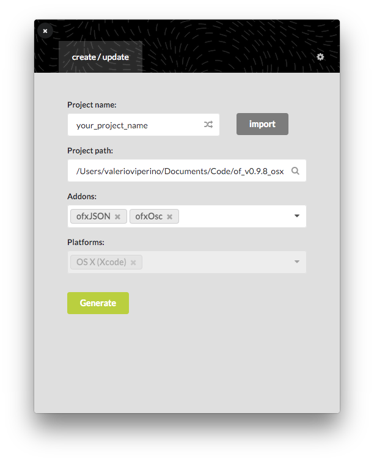
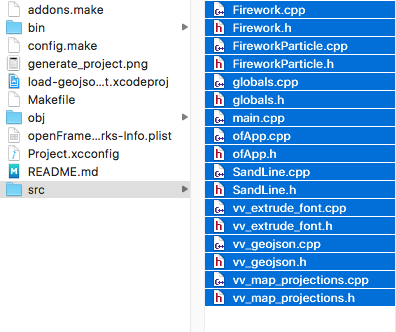
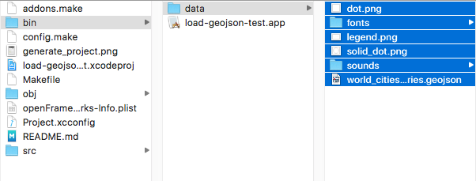

# README

IMPORTANT--> Use the **popup-installation** branch, which contains the latest changes.

This project was tested under macOS Sierra 10.12.6, gcc version 4.2.1, openframeworks version 0.9.8 using the **make** build system.<br>It should work also on Linux. <br>
The Arduino used for moving in the 3d space needs to run the standard firmata firmware, as explained [here](http://openframeworks.cc/documentation/communication/ofArduino/).<br>
It also requires [this other custom app](https://github.com/vvzen/MACA/tree/master/end-2-term-projects/wcc2/realtime-twitter-proto) to be running, see below for more infos.

## Compiling

There are two ways to build this project.

*The quickly up and running:*
1. Clone this folder of the repo wherever you want, cd into it and just type:<br>
    ```OF_ROOT=/path/to/your/of_v0.9.8_osx_release make && OF_ROOT=/path/to/your/of_v0.9.8_osx_release make RunRelease```
    <br>replacing the path with your actual of installation path (more info [here](https://vvzen.github.io/openframeworks/personal-dev-setup)). 

2. In case something goes wrong, ```OF_ROOT=/path/to/your/of_v0.9.8_osx_release make clean``` and try again.


*The cleaner and slower:*
1. Create a new project inside your openframeworks folder:

    

2. Copy all files under the *src* and *bin/data* folder to your new project *src* and *bin/data* folders:

    

    

3. Open terminal, cd into your folder and type inside your favourite shell: <br> 
    ```make && make RunRelease```

## Structure

This app listens to tweets coming as *OSC messages* from the companion nodejs app, which can be found [here](https://github.com/vvzen/MACA/tree/master/end-2-term-projects/wcc2/realtime-twitter-proto).<br>
Technically I could have just used *ofxTwitter* but to keep things simple and well separated I opted for using another small simple app responsible only for the twitter streaming and this one for all the heavy lifting.
The 3d map (left side) is rendered inside the *threed_map_fbo* ofFbo while the artwork uses the fbo inside the *sand_line* object.

I'm sorry that there are so many files, but each one does something unique:

### globals.cpp/h

Simply stores global variables (WIDTH and HEIGHT) avaible through all files thanks to `extern`.

### Sandline.cpp/h

Those files are responsible for the creation of the artwork on the right side of the screen.
It's a class with its own fbo that gets rendered in ofApp.cpp using the `get_fbo_pointer()` method.

### Firework.cpp/h and FireworkParticle.cpp/h

Those are used in the 3d map (left side) to create the little puff of smoke whenever a tweet arrives. Firework is a simple particle system where each particle is a point in ofMesh. Those points are then rendered to circles using the *firework_texture.bind()* method.

### vv_extrude_font.cpp/h

Originally responsible for creating the 3d text for each city's name. I'm now using it to create the 2d text of the city while resampling the number of points on its outline.

### vv_geojson.cpp/h

Parses the [GeoJSON](https://en.wikipedia.org/wiki/GeoJSON) file and creates the polygonal outline of the geographical shapes necessary for the map.
Also creates the text for each city by calling the method from `vv_extrude_font.cpp`. Internally utilizes ofVboMesh.
There is already an [addon](https://github.com/moxuse/ofxGeoJSON) for parsing GeoJSON files but  don't know why it was failing on my files, so I wrote my own parser which supports also the *Point* feature type and uses *ofVboMesh*, which should generally be faster (if you're not modifying the mesh after creating it). I'd love to PR the original repo when this will be mature enough.

### vv_map_projections.cpp/h

The methods inside those files could have been inside *vv_geojson*, but I decided to keep them separated since they are more generalised and are easier to reuse.
They simply convert coordinates from a geographical projection (spherical or mercator) to a cartesian space.

